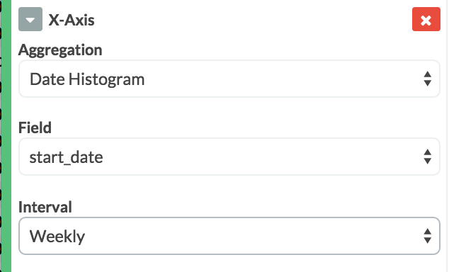

# Project Level Reporting

How to create a graph that shows the total hours by employee for a particular project.

Click "Visualize" at the top of Kibana, then choose "Area Chart"

The choose "From a new search"

A blank area chart workspace will appear:

At the top replace "\*" with "project=name" -- this only works for a single word where the word is unique.  If you don't have a unique word in your project you will need to use the project_id.

For the Y-Axis select Aggregation: Sum and Field: hours_spent.

Next we need to specify buckets!  Select "X-Axis"

Choose Aggregation: Date Histogram, Field: start_data, and Interval: Weekly

Next we want to add sub-buckets, of course...

For the buckets type, choose "Split Area"

Then select Sub Aggregation: Terms, Field: employee, Order: Top, Size: 50 (make sure this is larger than the number of people on your project), and Order By: metric: Sum of hours_spent

Then at the top of the left panel, click the green rectangle with a white arrow to apply the changes:

Voila!  A graph should appear on the right:

